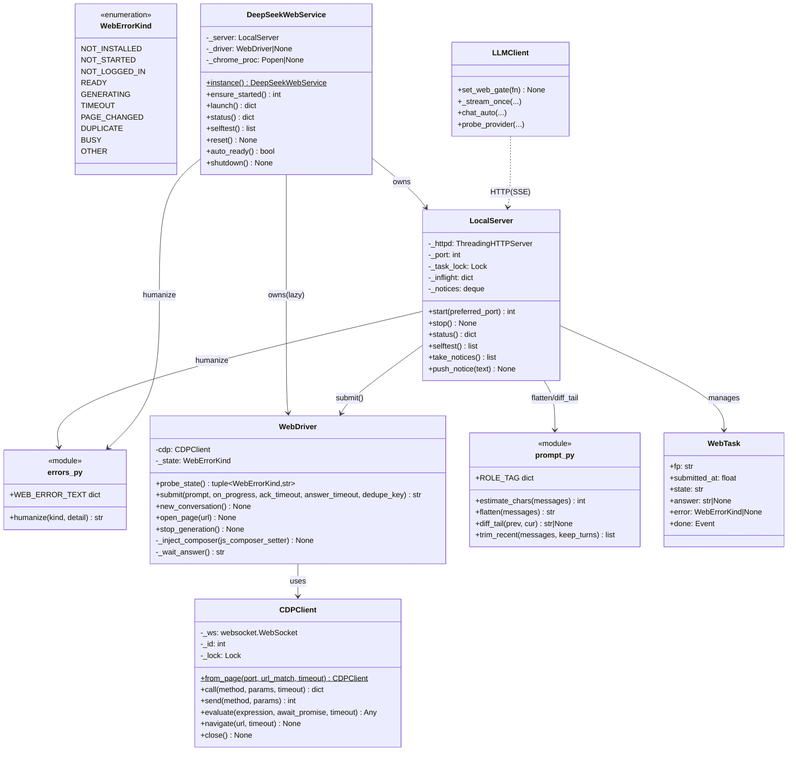
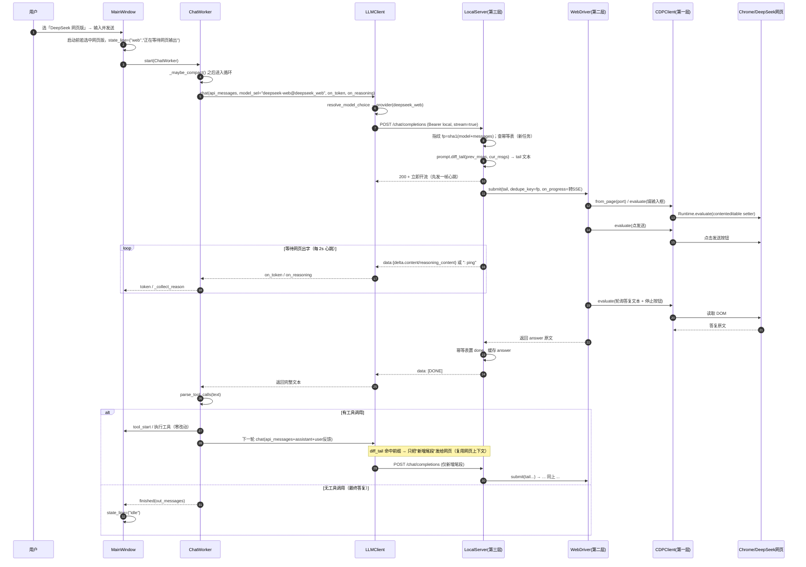
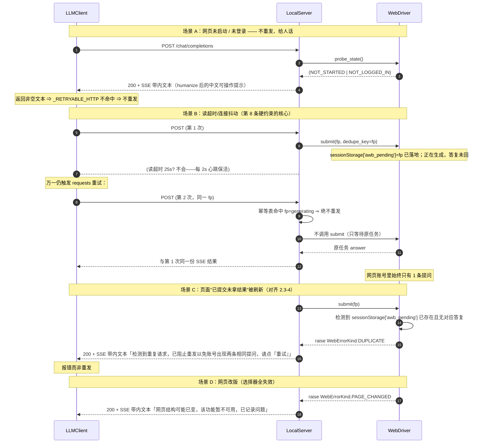
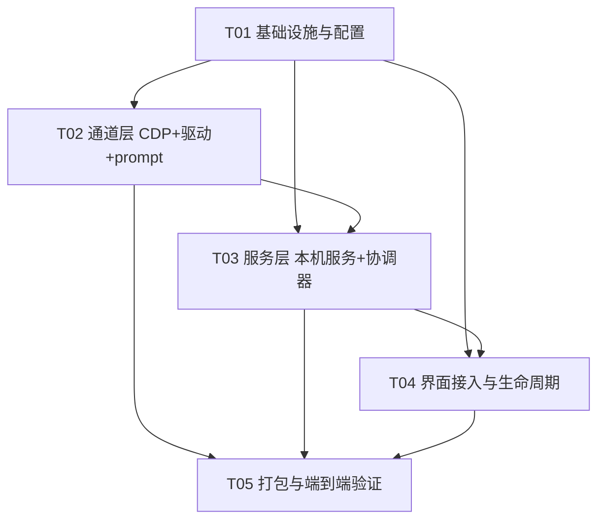

# 系统架构设计 + 任务分解：把 DeepSeek 网页版接入 AIWorkbench

> 作者：高见远（架构师） · 目标版本 v9.13.1 → **v9.14.0** · 语言：简体中文
> 依据：`docs/deepseek-web/00-context.md`（背景底稿）、`docs/deepseek-web/01-prd.md`（PRD）
> 以及**逐行核对过**的源码：`app/llm_client.py`、`app/config.py`、`app/winproc.py`、
> `app/gui/widgets.py`、`app/gui/chat_worker.py`、`app/gui/main_window.py`、`app/gui/pages.py`、
> `app/version.py`、`build_v9131.py`、`tests/probe_cdp_poc.py`、`tests/start_deepseek_login.py`。
>
> 已拍板的 5 项产品决策（直接采用）：① 不设默认、但纳入自动模式候选且仅在"已连接"时可用；
> ② 客户端串行 + 排队；③ 超长优先"新建网页对话 + 携带最近若干轮"且必须给可读提示；
> ④ 沿用 `strict`、失败不回退、但细分失败类型；⑤ 自动模式见①。

---

# Part A：系统设计

## 1. 实现方案与选型理由

### 1.1 核心难点

| 难点 | 说明 |
|---|---|
| D1 最小侵入 | Agent 循环、51 个工具、工具调用协议、现有 9 个页面**一律不许改**；接入点只有 `llm_client.py` 的"OpenAI 兼容客户端"这一处。 |
| D2 无 API 语义 | 网页版没有 `temperature/top_p/max_tokens/tool schema`，只有"一段提示词进、一段原文出"。 |
| D3 单会话 | 一个网页标签页只有一个会话，多次调用必须串行、且要解决"Agent 每轮都发全量 messages"与"网页只记一份上下文"的矛盾。 |
| D4 生命周期 | 拉起的 Chrome 要能复用登录态、要可见（后台标签被节流）、退出时要收拾干净。 |
| D5 硬约束 | `00-context.md` 3.4 节 8 条接入点硬约束（尤其第 1、8 条）必须逐条满足。 |

### 1.2 三层架构与职责边界（为什么这么切）

采用**三层**（对齐 `00-context.md` 3.2 节目标架构），逐层只做一件事，层间用"最笨、最稳的契约"连接：

```
AIWorkbench Agent 循环 / ChatWorker / 51 工具          ← 零改动
        │  messages[] / on_token / on_reasoning
app/llm_client.py  LLMClient._stream_once()             ← 只加"免密钥白名单 + 网页就绪钩子"两处小改
        │  POST http://127.0.0.1:<port>/chat/completions  (SSE)
┌─────────────────────────────────────────────────────────────────┐
│ 第三层：本机 OpenAI 兼容服务  app/deepseek_web/local_server.py    │
│   职责：讲"OpenAI 协议"；messages→单段提示词；结果→SSE chunk 流； │
│        串行队列 + 幂等表；失败翻译成中文 in-band 文本；心跳保活    │
├─────────────────────────────────────────────────────────────────┤
│ 第二层：DeepSeek 网页驱动  app/deepseek_web/web_driver.py         │
│   职责：讲"DeepSeek 网页"；状态机（未启动/未登录/就绪/生成中/错误）│
│        填 contenteditable 输入框 → 发送 → 判生成结束 → 抓答复原文  │
├─────────────────────────────────────────────────────────────────┤
│ 第一层：CDP 客户端  app/deepseek_web/cdp_client.py                │
│   职责：讲"Chrome 调试协议"；WS 连接 / Runtime.evaluate / navigate │
└─────────────────────────────────────────────────────────────────┘
        │  CDP over WebSocket（websocket-client）
本机 Chrome（专用 user-data-dir，已登录 chat.deepseek.com）
```

**为什么切三层，而不是两层或一层：**

- **必须有"本机 OpenAI 兼容服务"这一层（选型关键）**。`llm_client.py:131` 拼 `base_url + "/chat/completions"`、
  `:329` 用 `{base_url}/models` 体检 ⇒ **只要提供这两个端点，`config.py` 里加一个 provider 即可接入，
  Agent 循环 / chat_worker / 工具协议全部零改动**——这是全项目最小侵入的接入点。反之，若直接在
  `LLMClient` 里塞分支，就破坏了 D1。
- **CDP 客户端与"DeepSeek 网页驱动"必须分开**：CDP 是通用管道（换 Edge、换网站都不用改），
  网页驱动是易碎层（DeepSeek 一改版就要改选择器）。分开后，改版只影响 `web_driver.py` 一个文件，
  也便于把"网页改版"作为一类可识别的失败单独上报（决策④）。
- **prompt 转换单独成模块**：`messages→单段提示词`、`前缀增量判定`、`超长裁剪` 是纯函数，
  可单独测试（QA 友好），不掺网络与 DOM。

### 1.3 依赖包/框架选型

| 用途 | 选型 | 理由 |
|---|---|---|
| HTTP 服务端 | **Python 标准库 `http.server.ThreadingHTTPServer`** | 零新依赖；本机回环单用户，够用；避免为 1 个端点引入 Flask/FastAPI 拖大 exe。 |
| CDP 通信 | **`websocket-client`（已装 1.9.2 / 已在 requirements.txt）** | `tests/probe_cdp_poc.py` 已用它跑通握手+导航；dingtalk-stream 也依赖它。 |
| 浏览器启动 | **`app/winproc.py` 的 `popen()`** | 铁律：`app/` 下禁止裸 `subprocess`；winproc 已处理"不弹黑窗口"。 |
| HTML/文本解析 | 网页端**不解析 JSON**，只在客户端做（对齐 `00-context` 2.2 节"broker 是纯管道"的洞察） | 网页驱动只负责"提示词进、原文出"。 |

### 1.4 ★ 逐条满足 `00-context.md` 3.4 节的 8 条硬约束

| # | 约束（原文） | 本设计的明确解法（落在哪个文件） |
|---|---|---|
| **1** | **provider 必须非空 API Key**（`_stream_once` 128-130 行，空则 `raise LLMError("缺少 API Key")`） | **双保险**：<br>① 在 `config.py` 给 `deepseek_web` 打 **`"no_key": True`** 标记，并把 `_stream_once` 与 `probe_provider` 的判空从 `if not key:` 改成 **`if not key and not provider.get("no_key"):`**（改的是**允许改的接入点** `llm_client.py`）；<br>② 同时在 `config.DEFAULT_API_KEYS` 里 **`setdefault("deepseek_web", "local")`** 放一个占位 key。<br>**为什么两条都要**：占位 key 会被 `set_keys(self.settings.get("api_keys", {}))` 用空串覆盖（设置页会为每个 provider 生成 Key 输入框→保存空串），只靠占位不放"免密钥白名单"会二次踩坑。有了 `no_key` 标记，即使 key 被清空也照常工作；占位 key 则让 `probe_provider`/`probe_all` 的旧逻辑也能通过。 |
| **2** | **SSE 格式必须严格**（只认 `data:` 前缀行 / 180-186 行；正文取 `choices[0].delta.content`；结束认 `data: [DONE]`） | `local_server.py` 的 SSE 写手**严格**输出 `data: {...}\n\n`；每块 `{"choices":[{"index":0,"delta":{"content":"…"}}]}`；结束写 `data: [DONE]\n\n`。不写任何非 `data:` 内容块（心跳用 SSE 注释行 `: ping`，解析器 `:182` 会跳过，不影响正文）。 |
| **3** | **非流式也可兜底** | 本服务**永远返回 200 + SSE**（不走非流式），但 `_stream_once` 的兜底逻辑天然兼容；`_vision_once` 不用本通道（PRD 明确不做视觉走网页）。 |
| **4** | **`delta.reasoning_content` 是现成钩子**（197-199 行，界面已能渲染"深度思考"） | **加分点**：`web_driver` 抓到的 DeepSeek 网页"深度思考"（思维链）通过 SSE 的 `delta.reasoning_content` 单独下发，`on_reasoning` 会自动渲染成"深度思考"块，**零额外 UI 改动**。 |
| **5** | **请求体字段**（`model/messages/temperature/stream`；联网按 `search_style` 追加） | `config.py` 里该 provider 设 **`"search_style": "none"`**（`llm_client.py:89-90` 会跳过联网字段追加）；`local_server.py` **对多余字段全部容错**（只读 `messages`，忽略 `model/temperature/stream/tools/...`）。 |
| **6** | **必须实现 `/models`** | `local_server.py` 提供 `GET /models` → `{"object":"list","data":[{"id":"deepseek-web",...}]}`；设置页"开始体检"（`probe_provider`）与 `probe_all` 都能拿到 ✅。 |
| **7** | **超时语义**（`timeout=(10, timeout)`，读超时默认 25s，网页生成慢） | `local_server.py` 在"等待网页出字"期间**每 2 秒发一次 SSE 心跳**（`: ping` 注释行或空 delta），远小于 25s 读超时 ⇒ 连接不会被读超时切断，**无需改 `llm_client` 超时**。 |
| **8** | **重试语义**（429/5xx 会重发同一次请求；网页驱动必须保证"重发不在账号里产生两条提问"） | **两层正面回答**（这是本设计的重点）：<br>**第 1 层——让重试根本不发生**：本服务**永不返回 4xx/5xx**，一律 `200 + SSE`；所有失败都做**带内文本**（当 assistant 正文下发中文提示）。这样 `_RETRYABLE_HTTP` 分支永不命中；配合第 7 条心跳，连接层 `requests.Timeout/ConnectionError` 也不会触发重发。<br>**第 2 层——幂等兜底（万一还是重发）**：`local_server.py` 维护**幂等表**：请求指纹 `fp = sha1(model + json(messages))`；若同一 `fp` 正处于 `submitting/generating` → **绝不再提交**，而是**挂到同一任务**、把同一份输出镜像给第二个连接；若处于 `done` 且在 90s 宽限窗内 → 直接回放已存答复。`web_driver.submit(..., dedupe_key=fp)` 再落一层**页面级标记**（发送前在 `sessionStorage` 写 `awb_pending=fp`，已存在则不发送、报 `DUPLICATE`），完全对齐 `00-context` 2.3 节第 4 条"宁可报错也不重发"。 |

---

## 2. 文件列表及相对路径

### 2.1 新增文件（全部自研，禁止搬运 DSH-webtokens / dsh-webtokens-lite 代码）

| 相对路径 | 一句话职责 |
|---|---|
| `app/deepseek_web/__init__.py` | 子包入口；导出 `service.instance()` 单例与版本常量。 |
| `app/deepseek_web/errors.py` | 统一失败类型枚举 `WebErrorKind` + 中文文案映射 `humanize()`（未登录/网页改版/超时/无 Chrome/其他/重复/忙碌）。 |
| `app/deepseek_web/cdp_client.py` | 第一层：CDP 最小封装（`call/send/evaluate/navigate/close`），只懂"协议"，不懂 DeepSeek。 |
| `app/deepseek_web/web_driver.py` | 第二层：DeepSeek 网页驱动 + 状态机（探测登录态、填输入框、发送、判结束、抓原文、新对话、防重发）。 |
| `app/deepseek_web/prompt.py` | `messages[] → 单段提示词`；前缀增量判定 `diff_tail()`；超长裁剪 `trim_recent()`；字符估算。 |
| `app/deepseek_web/local_server.py` | 第三层：本机 OpenAI 兼容服务（`/chat/completions` 流式 + `/models` + `/healthz` + `/status` + `/web/*`）；串行队列 + 幂等表 + 心跳。 |
| `app/deepseek_web/service.py` | 进程内**单例协调器**：起停 server、拉/收拾 Chrome、注入端口、状态查询、连通性自检、通知队列、（`auto_ready()`）。 |
| `tests/probe_deepseek_web.py` | 离线探针：纯 HTTP 测 `/models`、`/status`、`/healthz`、SSE 格式正确性（不需要浏览器）。 |
| `tests/probe_cdp_state.py` | 探针：真实登录态下核对网页选择器 / 状态机判定（`state()`、`new_conversation()`）。 |
| `tests/probe_deepseek_web_e2e.py` | 端到端探针：本机服务 → CDP → 网页 → 取回答复的完整闭环 + 失败分支。 |
| `build_v9140.py` | 新打包脚本（自 `build_v9131.py` 复制改名，`DIST=dist_v9140`，显式补 `app.deepseek_web.*` 的 hidden-import）。 |

### 2.2 改动文件（精确到位置）

| 相对路径 | 改什么（一句话） |
|---|---|
| `app/config.py` | 追加 provider `deepseek_web`（`no_key/web=True`、`search_style="none"`、`base_url` 指向本机）；新增常量 `WEB_*`；`DEFAULT_API_KEYS.setdefault("deepseek_web","local")`；把 `"deepseek_web"` 追加到 `PROVIDER_PRIORITY` **末尾**。 |
| `app/llm_client.py` | 仅 3 处小改：① `_stream_once` 的 key 判空加 `and not provider.get("no_key")`；② `probe_provider` 同样处理；③ `chat_auto` 的"跳过无 Key 端点"加 `and not p.get("no_key")`，并新增 `web_gate` 钩子（网页版未就绪则静默跳过）+ `set_web_gate()`。 |
| `app/gui/widgets.py` | `StatusLine._PHASES` 增加 `"web": ("🌐","正在等待 DeepSeek 网页输出")` 一个阶段（复用 v9.13 规范，不改其它）。 |
| `app/gui/pages.py` | `SettingsPage._tab_model()` 内新增「DeepSeek 网页版」区块（状态行 + 3 按钮 + 风险说明）；区块方法 `_tab_model` 与 `load/_save` 增补 `deepseek_web_*` 设置项。 |
| `app/gui/main_window.py` | 接线：`__init__` 起 `service.instance().ensure_started()` + 注入 `web_gate` + 绑定区块按钮 + 状态轮询定时器；`_on_phase` 兼容 `web` 阶段；退出时 `service.shutdown()`；`set_keys` 后保持免密钥 provider 可用。 |
| `app/version.py` | `VERSION="9.14.0"`、`VERSION_TUPLE=(9,14,0)`、`BUILD_DATE` 更新。**不改 `DEFAULT_SYSTEM_PROMPT`，故 `PROMPT_VERSION` 保持 24。** |

> **零侵入自查**：`app/agent.py`、`app/gui/chat_worker.py`、51 个工具、工具调用协议、其余页面**均不出现于改动清单**。

---

## 3. 接口与数据结构

### 3.1 类图



### 3.2 关键接口签名

**`app/deepseek_web/cdp_client.py`（第一层最小封面对外只暴露这些）**

```python
class CDPClient:
    @classmethod
    def from_page(cls, port: int, url_match: str = "chat.deepseek.com",
                  timeout: float = 25.0) -> "CDPClient":
        """GET http://127.0.0.1:{port}/json 选一个 type=='page' 且 url 含 url_match 的 target，
        取其 webSocketDebuggerUrl 建立 ws 连接。（复用 probe_cdp_poc.py 已验证的写法）"""

    def call(self, method: str, params: dict | None = None,
             timeout: float | None = None) -> dict:
        """发一条 CDP 命令并同步等回包（按 id 匹配），返回整个消息 dict。"""

    def send(self, method: str, params: dict | None = None) -> int:
        """只发不等回包（用于 Page.enable/Runtime.enable 这类不需要结果的命令）。"""

    def evaluate(self, expression: str, await_promise: bool = True,
                 timeout: float | None = None) -> Any:
        """Runtime.evaluate(returnByValue=True, awaitPromise=await_promise) 取 result.value。"""

    def navigate(self, url: str, timeout: float | None = None) -> None: ...
    def close(self) -> None: ...
```

**`app/deepseek_web/web_driver.py`（状态机）**

```python
class WebDriver:
    # 状态取值直接复用 WebErrorKind：NOT_STARTED / NOT_LOGGED_IN / READY / GENERATING / PAGE_CHANGED
    def probe_state(self) -> tuple[WebErrorKind, str]:
        """返回 (状态, 中文说明)。判定靠注入 JS：
        - 页面可达且 DOM 有输入框 → READY（若登录提示命中 → NOT_LOGGED_IN）
        - CDP 连不上 → NOT_STARTED；JS 抛错/选择器全空 → PAGE_CHANGED"""

    def submit(self, prompt: str, *, on_progress=None,
               ack_timeout: float = 12.0, answer_timeout: float = 300.0,
               dedupe_key: str | None = None) -> str:
        """一轮：① 防重发标记 → ② 填输入框(contenteditable) → ③ 点发送 →
        ④ ack：12s 内须出现"输入框被清空 或 停止按钮" → 否则 raise TIMEOUT（不重发）→
        ⑤ 等生成结束（停止按钮消失 且 文本 ≥800ms 未变，或文本是完整对象）→
        ⑥ 抓答复原文返回。on_progress(delta, reasoning) 供服务层转 SSE。"""

    def new_conversation(self) -> None: ...   # 点「新对话」；找不到入口 → raise PAGE_CHANGED
    def open_page(self, url: str = "https://chat.deepseek.com/") -> None: ...
    def stop_generation(self) -> None: ...
```

**`app/deepseek_web/local_server.py`（HTTP 端点）**

| 方法 | 路径 | 说明 |
|---|---|---|
| POST | `/chat/completions` | OpenAI 兼容**流式 SSE**。请求体按 `_build_payload` 原样接收，**只读 `messages`**。响应**永远 200**。 |
| GET | `/models` | `{"object":"list","data":[{"id":"deepseek-web","object":"model","owned_by":"local-web"}]}`。 |
| GET | `/healthz` | `{"ok":true,"state":"ready"}`。 |
| GET | `/status` | `{"state","kind","detail","logged_in","chrome","queue","port","last_error"}`。 |
| POST | `/web/launch` | 拉起 Chrome + 打开网页（**仅由用户点按钮触发**），返回 `{"ok","detail"}`。 |
| POST | `/web/selftest` | 三项自检：① 网页可达 ② 已登录 ③ 能否取回一条答复；返回 `[{"name","ok","detail"}]`。 |
| POST | `/web/retry` | 「重试」：重连 CDP / 重载网页（**不重发**历史提问）。 |

**SSE 每块格式（严格对齐 `_stream_once` 解析器）**

```
data: {"id":"chatcmpl-web-1","object":"chat.completion.chunk","model":"deepseek-web","choices":[{"index":0,"delta":{"content":"你"},"finish_reason":null}]}

: ping

data: {"choices":[{"index":0,"delta":{"reasoning_content":"（网页版深度思考）"}}]}

data: [DONE]
```

**`app/deepseek_web/service.py`（单例）**

```python
class DeepSeekWebService:
    @classmethod
    def instance(cls) -> "DeepSeekWebService": ...
    def ensure_started(self) -> int:   # 起 LocalServer → 把实际端口写回 config provider.base_url
    def launch(self) -> dict:          # 找浏览器 → winproc.popen 拉起专用 profile → 连 CDP
    def status(self) -> dict: ...
    def selftest(self) -> list: ...
    def reset(self) -> None: ...
    def auto_ready(self) -> bool:      # 供 llm_client.chat_auto 的 web_gate 使用
    def notify(self, text: str) -> None    # 线程安全地推一条"给用户看"的提示（新对话/超长）
    def take_notices(self) -> list:        # 主窗口定时器取走
    def shutdown(self) -> None: ...
```

**`app/config.py` 追加内容（示意）**

```python
WEB_PROVIDER_NAME = "deepseek_web"
WEB_MODEL_ID = "deepseek-web"
WEB_DEFAULT_PORT = 18921

PROVIDERS.append({
    "name": WEB_PROVIDER_NAME,
    "label": "DeepSeek 网页版",
    "base_url": f"http://127.0.0.1:{WEB_DEFAULT_PORT}",   # 运行时由 service 覆盖为真实端口
    "free": True,
    "search_style": "none",   # 命中 llm_client.py:89-90，不追加联网字段
    "no_key": True,           # ★ 免密钥白名单（满足硬约束 1）
    "web": True,              # ★ 网页通道标记（auto 模式要查就绪态）
    "models": [{"id": WEB_MODEL_ID, "name": "DeepSeek 网页版（免费·深度思考）", "free": True}],
})
DEFAULT_API_KEYS.setdefault(WEB_PROVIDER_NAME, "local")   # 占位 key，双保险
PROVIDER_PRIORITY.append(WEB_PROVIDER_NAME)                # 放最后：不抢免费 API，仅作兜底候选
```

**`app/llm_client.py` 三处小改（精确）**

```python
# __init__ 追加
self.web_gate = None         # callable -> bool；由界面注入。None = 不启用网页闸门

def set_web_gate(self, fn):
    self.web_gate = fn

# ① _stream_once（原 128-130 行）
key = self.keys.get(provider["name"], "")
if not key and not provider.get("no_key"):
    raise LLMError(f"[{provider['label']}] 缺少 API Key")

# ② probe_provider（原 326-328 行）
key = self.keys.get(p["name"], "")
if not key and not p.get("no_key"):
    return False, "没有配置 API Key", []

# ③ chat_auto（原 243-244 行附近）
for pname in config.PROVIDER_PRIORITY:
    p = config.provider_by_name(pname)
    if not p:
        continue
    if not self.keys.get(p["name"]) and not p.get("no_key"):
        continue
    if p.get("web") and self.web_gate is not None and not self.web_gate():
        continue          # ★ 网页版未连接/未启动：静默跳过，绝不主动拉浏览器
    ...
```

---

## 4. 调用时序图

### 4.1 主链路：用户发一条消息 →（Agent 模式）→ 本机服务 → CDP → 网页 → 回来



### 4.2 失败 / 重试分支（重点体现"绝不重发"）



---

## 5. 多轮与上下文策略

**问题**：一个网页标签页**只有一个会话**；而 Agent 循环**每一轮都重发全量 `messages[]`**（见 `chat_worker._run_impl`：`self.api_messages` 随轮次增长）。二者直接对接会"每轮把整段历史重打一遍"，既慢又浪费，且可能触发网页超长。

**策略：以"网页会话状态 = 我们上次发过的消息列表"为不变量，做前缀增量下发。**

1. `LocalServer` 为"当前网页会话"保存 `sent_messages`（我们**认为**网页已拥有的完整消息列表）与其指纹。
2. 每来一次请求，调用 `prompt.diff_tail(sent_messages, cur_messages)`：
   - **前缀命中（cur 是 sent 的严格扩展）** → 只把**新增尾段**（通常是"上一轮 assistant 的工具调用文本 + 本轮 tool 结果（role=user）"）拼成一段提示词发给网页。网页靠自身记忆保住上文 ⇒ 多轮成立，且每次请求很小。**这是 Agent 模式的常态路径。**
   - **前缀不命中**（切换了 AIWorkbench 会话、历史被压缩、用户编辑重发） → 判定为"不同对话"，**自动 `new_conversation()` 新建网页对话**，并把**全量平铺**后发送；同时 `service.notify()` 推一条可读提示。
3. `sent_messages` 在每次成功取回答复后更新为 `cur_messages`。

**超长处理（决策③：优先新建对话 + 携带最近若干轮，必须给提示、禁止静默丢弃）**：
- 累计已发送字符数（`prompt.estimate_chars`）超过阈值（建议 **60k 字符**）时：
  - 调 `prompt.trim_recent(cur_messages, keep_turns=6)` 保留 system + 最近 6 轮；
  - `new_conversation()` 后把"裁剪后的最近若干轮"平铺发送；
  - **必须** `service.notify("网页会话较长，已新建网页对话并携带最近 6 轮上下文（更早内容未带入网页）。")`，主窗口把它显示成灰色提示胶囊。
- 绝不静默丢历史：任何裁剪都伴随提示。

**对话隔离（不串台）**：
- 隔离信号 = **消息前缀指纹**，不是网页侧会话 id（网页侧我们拿不到稳定 id）。前缀一变即"换对话 → 新建网页对话"，天然隔离。
- AIWorkbench 是单窗口、单活动会话（`main_window.self.conv` 同一时刻只有一个），所以"串行 + 单网页会话"足够；不需要多标签页池。
- 单轮内（Agent 的多轮工具循环）属于同一 `sent_messages` 前缀链，不会误触发新建对话。

---

## 6. 安全与健壮性

| 项 | 方案 |
|---|---|
| **仅回环** | `ThreadingHTTPServer` 绑定 `("127.0.0.1", port)`，**绝不绑 `0.0.0.0`**。 |
| **端口选择** | 首选固定端口 `18921`；被占用则**回退到系统随机端口**（`port=0`）；实际端口由 `service.ensure_started()` **写回 `config` provider 的 `base_url`**（`provider_by_name` 返回的是同一 dict 对象，原地改即生效）。 |
| **Host 校验（防 DNS rebinding）** | 每个请求校验 `Host` 头必须是 `127.0.0.1:<port>` 或 `localhost:<port>`，否则 403。 |
| **轻量鉴权** | 要求 `Authorization: Bearer <任意非空>`（占位 key `"local"` 天然充当共享口令）；不返回任何 CORS 头，减少浏览器页面直接调用的面。 |
| **防重复发送（第 8 条硬约束）** | 见 1.4 第 8 条：**服务层幂等表（fp）+ 驱动层 `sessionStorage` 标记**，同 fp 在途/宽限窗内一律不重发；被刷新打断只报错不重发。 |
| **超时与心跳** | 提交后 `ack_timeout=12s`（12s 内没等到"输入框被清空/出现停止按钮"→ 判 TIMEOUT，**不重发**）；`answer_timeout=300s`（生成上限）。等待期间**每 2s** 发 SSE 心跳，保证 `_stream_once` 的 25s 读超时不触发。 |
| **串行 + 排队（决策②）** | `LocalServer._task_lock` + 队列计数；并发请求排队，`/status.queue>0` 时 SSE 先发带内提示「前面还有 N 个任务，排队中…」，`state_line` 显示 `BUSY`。 |
| **失败细分（决策④）** | 全部走 `errors.WebErrorKind` + `humanize()`：未登录→"请先在网页里登录"；网页改版→"网页结构可能已变"；超时→"已等待 N 秒仍未返回，可点重试（不会重发）"；无 Chrome→"未检测到 Chrome，请先安装"；其他→通用中文 + 建议。**均以带内文本下发，无英文堆栈裸露。** |
| **退出收拾 Chrome** | `service` 持有 `winproc.popen` 返回的 `Popen` 句柄与调试端口；`MainWindow.closeEvent` → `service.shutdown()`：先 `stop()` HTTP 服务，再对**我们拉起的那个 Chrome 实例**（按 user-data-dir/端口定位）结束，最后释放 CDP ws。若用户手动关掉网页窗口，下次 `launch()` 检测端口在线即复用。 |
| **不主动拉浏览器** | Chrome **只在**用户点「启动/打开网页」或「重试」时启动；`chat_auto` 的 `web_gate` 在未就绪时**静默跳过**；选中网页版但未启动时，走带内中文提示，而非弹窗。 |

---

## 7. 任务列表（有序，工程师照此开工）

> 硬性纪律：任务 ≤ 5 个；每个任务 ≥ 3 个相关文件；T01 必为"项目基础设施"；配置文件不分散。
> 优先只依赖 T01，避免长线性链。

### T01 —— 项目基础设施与配置接线（P0）
**改哪些文件 / 达成什么：**
- `app/deepseek_web/__init__.py`【新增】：建子包，导出 `service`、`errors`。
- `app/deepseek_web/errors.py`【新增】：`WebErrorKind` 枚举 + `WEB_ERROR_TEXT` + `humanize()`；四类失败中文文案（未登录/网页改版/超时/无 Chrome/其他/重复/忙碌）。
- `app/config.py`【改】：按 3.2 节追加 `deepseek_web` provider、`WEB_*` 常量、`DEFAULT_API_KEYS.setdefault`、`PROVIDER_PRIORITY.append`。
- `app/llm_client.py`【改】：按 3.2 节三处小改（`no_key` 白名单 ×2 + `web_gate` 钩子）。
- `app/version.py`【改】：`VERSION/TUPLE/BUILD_DATE` → 9.14.0（`PROMPT_VERSION` 保持 24）。
**验收**：`python -c "from app import config; print(config.provider_by_name('deepseek_web'))"` 正常；`python -c "import app.llm_client, app.deepseek_web.errors"` 无错；下拉框 `config.all_models_sorted()` 里出现 deepseek-web。
**依赖**：无。 **优先级**：P0。

### T02 —— 通道层：CDP 客户端 + 网页驱动 + 提示词转换（P0）
**改哪些文件 / 达成什么：**
- `app/deepseek_web/cdp_client.py`【新增】：实现 3.2 节 `CDPClient` 全部方法（复用 `tests/probe_cdp_poc.py` 已验证的握手/导航写法，但**不得逐字搬运任何第三方仓库代码**）。
- `app/deepseek_web/web_driver.py`【新增】：`probe_state()` / `submit()` / `new_conversation()` / `open_page()` / `stop_generation()`；输入框**必须兼容 contenteditable 富文本**（`00-context` 2.3-1）；结束判定用"停止按钮消失 且 文本 ≥800ms 未变"（2.3-3）；`sessionStorage` 防重发（2.3-4）；12s ack（2.3-5）。
- `app/deepseek_web/prompt.py`【新增】：`ROLE_TAG`、`flatten`、`diff_tail`、`trim_recent`、`estimate_chars`（纯函数，可单测）。
**验收**：`tests/probe_cdp_state.py` 在**真实登录态**下能判定 READY/NOT_LOGGED_IN；`prompt.py` 的 `diff_tail` 单测：扩展返回增量、非前缀返回 None。
**依赖**：T01。 **优先级**：P0。

### T03 —— 服务层：本机 OpenAI 兼容服务 + 协调器（P0）
**改哪些文件 / 达成什么：**
- `app/deepseek_web/local_server.py`【新增】：`ThreadingHTTPServer` + 全部端点（3.2 节表格）；严格 SSE（硬约束 2）；**永远 200 + 带内中文失败**（硬约束 8 第 1 层）；幂等表 + 串行队列 + 2s 心跳（硬约束 7、8 第 2 层）；Host 校验 + 回环绑定 + 端口回退。
- `app/deepseek_web/service.py`【新增】：单例；`ensure_started()`（起 server 并回写端口）、`launch()`（`winproc.popen` 拉 Chrome）、`status/selftest/reset/auto_ready/notify/take_notices/shutdown`；**Chrome 进程句柄管理**。
- `tests/probe_deepseek_web.py`【新增】：离线探针（不起浏览器）——断言 `/models`、`/status`、`/healthz` 与 SSE 文本格式（`data:` 行、`[DONE]` 收尾、心跳注释可被忽略）。
**验收**：探针全绿；`curl 127.0.0.1:<port>/models` 返回合法 JSON；未启动 Chrome 时 `POST /chat/completions` 返回 200 + 中文提示且**不重发**。
**依赖**：T01、T02。 **优先级**：P0。

### T04 —— 界面接入与生命周期（P0）
**改哪些文件 / 达成什么：**
- `app/gui/widgets.py`【改】：`StatusLine._PHASES` 增加 `"web"` 阶段。
- `app/gui/pages.py`【改】：`SettingsPage._tab_model()` 追加「DeepSeek 网页版」区块（状态行 + `启动/打开网页`、`连通性自检`、`重试` 三按钮 + 灰字风险说明，对齐 PRD 4 节）；`load/_save` 增补 `deepseek_web_*` 项。
- `app/gui/main_window.py`【改】：`__init__` 里 `service.instance().ensure_started()` + `client.set_web_gate(service.instance().auto_ready)` + 绑定区块按钮 + 状态轮询 QTimer（同时 `take_notices()` 显示为提示胶囊）；`_on_phase` 兼容 `web`；`closeEvent` 调 `service.shutdown()`；选中网页版时状态行显示 `web` 阶段。
**验收**：设置页出现区块且四态随实际变化；三按钮可用；选中网页版发消息时状态行显示"正在等待 DeepSeek 网页输出"；退出后我们拉起的 Chrome 被收拾。
**依赖**：T01、T03。 **优先级**：P0。

### T05 —— 打包与端到端验证（P0）
**改哪些文件 / 达成什么：**
- `build_v9140.py`【新增】：自 `build_v9131.py` 复制改名，`DIST=dist_v9140`、`VERSION_FILE=build_v9140_version.txt`；hidden-import 显式补 `app.deepseek_web`、`app.deepseek_web.cdp_client`、`app.deepseek_web.web_driver`、`app.deepseek_web.local_server`、`app.deepseek_web.service`、`websocket`（已在列表，确认保留）；exclude 不变。
- `tests/probe_deepseek_web_e2e.py`【新增】：端到端——本机服务 → CDP → 网页 → 取回答复（含成功 + 失败/重试两个分支）。
- `tests/probe_cdp_state.py`【新增，若 T02 未落地则在此完成】：选择器/状态机核对。
**验收**：源码跑通全回归 → 冻结 → `python build_v9140.py` → `dist_v9140/AIWorkbench` 可启动；干净机器（仅装 Chrome）登录一次后跑通"对话 + 3 工具真调用"；交付时报出 exe 绝对路径。
**依赖**：T01、T02、T03、T04。 **优先级**：P0。

### 任务依赖图



---

## 8. 依赖包列表

| 包 | 状态 | 说明 |
|---|---|---|
| `websocket-client` | **已安装 1.9.2 / 已在 `requirements.txt`（第 41 行）** | CDP WebSocket 通道；无需新增依赖。 |
| `requests` | 已在 `requirements.txt` | 探针与本地回环调用用。 |
| `http.server` / `socketserver` / `threading` / `hashlib` / `urllib` | **Python 标准库** | 本机服务与 CDP 的 HTTP 发现口，零新增依赖。 |

**新增第三方包：无。**

**PyInstaller（`build_v9140.py`）要点：**
- `--hidden-import websocket` **已存在**（`build_v9131.py` 第 140 行），保留即可。
- **显式补** `app.deepseek_web`、`app.deepseek_web.cdp_client`、`app.deepseek_web.web_driver`、`app.deepseek_web.local_server`、`app.deepseek_web.service`（这些模块可能被惰性/间接导入，静态分析易漏）。
- 无需 `--collect-data` / `--collect-binaries`（无数据文件、无二进制扩展）。
- 打包前先 `mv build/ D:\aiworkbench_old_builds\`（沙箱保护）。

---

## 9. 共享知识（跨文件约定）

- **命名**
  - 子包统一 `app/deepseek_web/`；模块名全小写下划线。
  - 单例入口固定：`from app.deepseek_web import service` → `service.instance()`。
  - 常量集中在 `app/config.py`（`WEB_PROVIDER_NAME="deepseek_web"`、`WEB_MODEL_ID="deepseek-web"`、`WEB_DEFAULT_PORT=18921`、`WEB_MAX_PROMPT_CHARS=60000`、`WEB_ACK_TIMEOUT=12.0`、`WEB_ANSWER_TIMEOUT=300.0`、`WEB_DEDUPE_GRACE=90.0`、`WEB_HEARTBEAT=2.0`）；仅"运行时会变的端口"例外，由 `service` 回写 `provider["base_url"]`。
  - provider name = `deepseek_web`；模型 id = `deepseek-web`；下拉 choice = `deepseek-web@deepseek_web`。
- **错误类型统一**
  - **唯一**错误枚举：`app/deepseek_web/errors.py::WebErrorKind`。任何层抛出的失败都先归类到它，再由 `humanize()` 转中文；**禁止**在别处另造字符串错误码。
  - 对 `LLMClient` 而言，失败始终表现为"HTTP 200 + 带内中文文本"或连接层异常；**不制造 4xx/5xx**。
- **常量/配置放哪**：见上；跨模块只读 `config`，不各自硬编码。
- **日志**
  - 统一写 `%TEMP%/aiworkbench_deepseek_web.log`（append，utf-8，失败静默），格式 `时间 | 层 | 事件 | 关键字段`；`service` 提供 `log(level, msg)`，各层通过它写。**绝不写任何用户内容/密钥/history**（沿用项目隐私红线）。
- **线程模型**：HTTP 服务线程 + `web_driver` 在请求线程内同步跑（已串行）；`service._notices` 用 `threading.Lock` 保护；UI 侧只通过 QTimer 轮询取通知（**不**跨线程直接碰 Qt 对象）。
- **零侵入红线**：`app/agent.py`、`app/gui/chat_worker.py`、51 个工具、`app/gui/main_window.py` 之外页面结构，**一律不改**。

---

## 10. 待明确事项（最多 3 条，需工程师在真机核对后回填）

1. **DeepSeek 网页关键选择器**：「新对话」入口、发送按钮、停止按钮、答复容器的真实 DOM 选择器，必须在**已登录真机**上用 `tests/probe_cdp_state.py` 核对并写成"多候选 + 兜底"。这是改版风险最高点，本设计只能给出判定逻辑与容错策略，无法凭空给出稳定选择器。
2. **超时数值标定**：`WEB_ACK_TIMEOUT=12s`、`WEB_ANSWER_TIMEOUT=300s`、幂等宽限 `90s` 为建议值，需按实测（尤其长回复/深度思考）校准后写死。
3. **auto 模式中网页版的位置与超时**：网页版比 API 慢。是否在 auto 模式给网页版**单独放宽超时**、以及是否**始终置于 `PROVIDER_PRIORITY` 末尾**（当前设计为末尾），需在实测延迟后确认。
